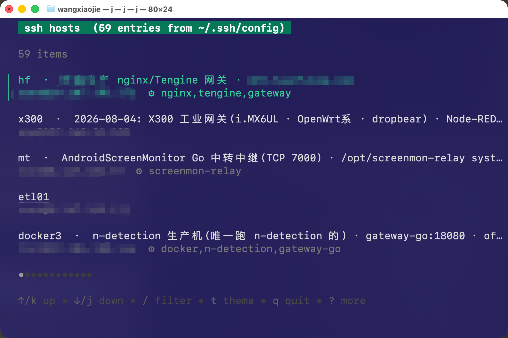
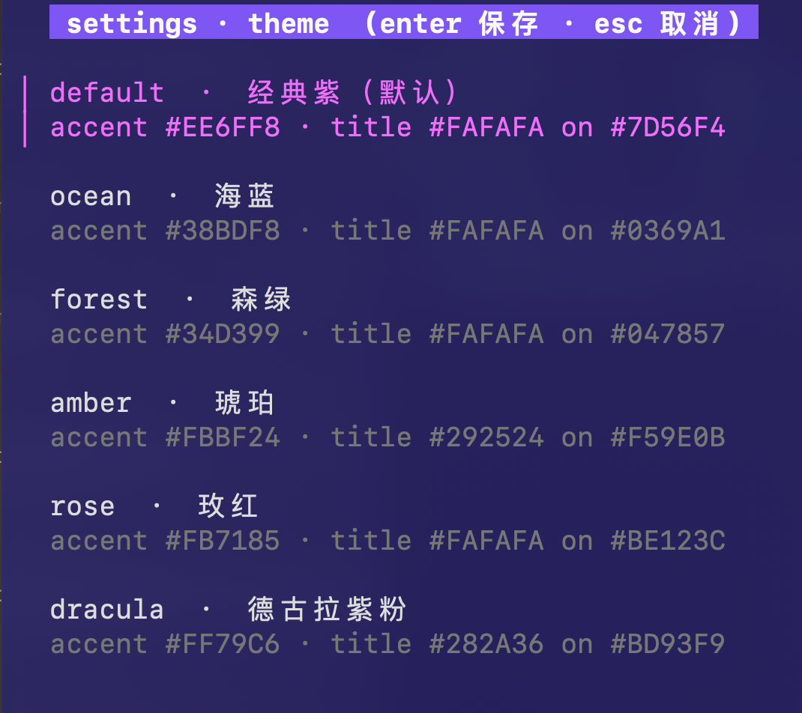
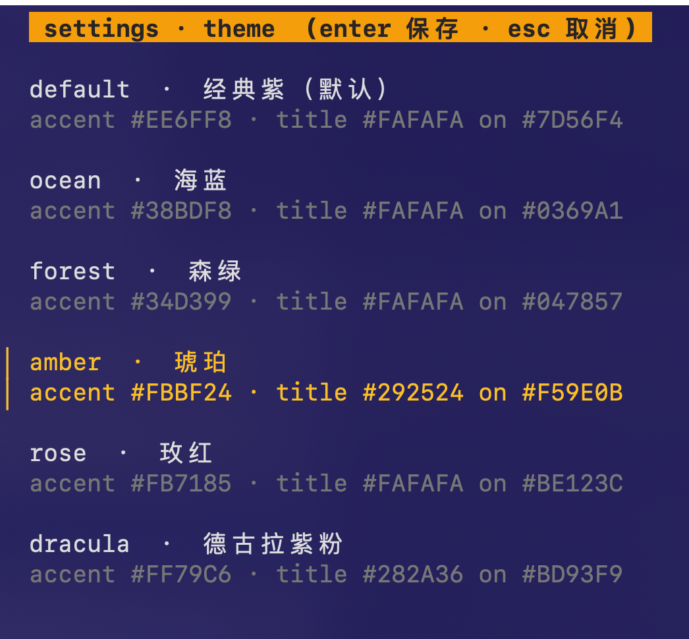

# jump-cli

**[中文文档](README.md)** | English

A terminal SSH host selector. Reads `~/.ssh/config`, launches a fuzzy-search TUI powered by [bubbletea](https://github.com/charmbracelet/bubbletea), and `exec`s into `ssh <host>` on Enter.




## Features

- **Fuzzy search**: type to filter — host names, comments, tags, and services all match
- **MRU ordering**: recently used hosts float to the top; press `d` to drop one from history
- **CLI prefill**: `jump prod` filters first, then opens the TUI; `jump s1` connects directly on exact name match
- **Comment conventions**: `#` comments in your ssh config become list descriptions, and can carry behavior tokens: `cwd=` / `tag=` / `svc=` / `cmd=`
- **8 color themes**: `--theme` / `JUMP_THEME` / press `t` in the TUI for live preview and persistence
- **zsh completion**: `jump <TAB>` lists all hosts (MRU order, with comments)
- **Zero config**: hosts without any token behave exactly like plain `ssh <host>`; selection `exec`s ssh, replacing the process — no wrapper left behind

## Installation

### Pre-built binaries (recommended)

Download the matching binary from [Releases](https://github.com/985860612/jump-cli/releases):

| Platform | Arch | File |
|----------|------|------|
| macOS | Intel | `jump-*-darwin-amd64` |
| macOS | Apple Silicon | `jump-*-darwin-arm64` |
| Linux | x86_64 | `jump-*-linux-amd64` |
| Linux | ARM64 | `jump-*-linux-arm64` |
| Windows | x86_64 | `jump-*-windows-amd64.exe` |

```bash
# macOS / Linux
chmod +x jump-v0.1.0-darwin-arm64
sudo mv jump-v0.1.0-darwin-arm64 /usr/local/bin/jump
ln -s /usr/local/bin/jump /usr/local/bin/j  # optional short alias
```

### Build from source

```bash
git clone https://github.com/985860612/jump-cli.git
cd jump-cli
./build.sh
```

`build.sh` installs the binary to `~/bin/jump` and creates a symlink `~/bin/j`.

Make sure `~/bin` is in your PATH:

```bash
echo 'export PATH="$HOME/bin:$PATH"' >> ~/.zshrc
source ~/.zshrc
```

## Usage

```bash
jump                    # full-list TUI
jump prod               # TUI pre-filtered by 'prod'; connects directly if it's an exact host name
jump s1                 # exact host name match → ssh s1 immediately
jump s1 -p 2222         # direct connect + pass -p 2222 through to ssh
jump -p 2222            # full-list TUI; -p 2222 passed through on selection
jump --theme ocean      # open TUI with a specific theme
jump --themes           # print all themes (with color swatches)
jump --list             # print 'name\tdesc' lines, used by the completion script
jump --completion       # print the zsh completion script
jump -v                 # print version
```

### TUI keys

| Key | Action |
| --- | --- |
| `Enter` | select → ssh (while filtering: accept the filter) |
| `/` | enter filter mode |
| `t` | open the settings panel (theme picker — ↑↓ live preview, `Enter` save, `Esc` revert) |
| `d` | remove the current host from MRU history (the host itself stays; it falls back to config order next launch) |
| `q` / `Esc` / `Ctrl+C` | quit |

## SSH config comment conventions

On top of standard ssh config parsing, jump recognizes two kinds of comments and displays them in the list:

1. **`#` comment line immediately above a `Host` line** (no blank line in between)
2. **Trailing `# comment` at the end of a `Host` line**

Both may coexist and will be joined with ` · `. Comments are also included in fuzzy matching.

### Behavior tokens in comments

Tokens are silently stripped from the display text and only trigger behavior:

| Token | Form | Behavior |
| --- | --- | --- |
| `cwd=` / `cwd:` | single token | on select: `ssh -t <host> 'cd <cwd> && exec ${SHELL:-/bin/sh} -l'` |
| `tag=` / `tag:` | single token | list title gets a `[tag]` prefix; participates in fuzzy matching |
| `svc=` / `svc:` | single token (comma-separated services, no spaces) | list description shows `⚙ <svc>` — what services run on this machine |
| `cmd=` | **greedy to end of line**, must come last | on select: `ssh -t <host> '<cmd>'`, exits when done; `cd`s first if `cwd=` is also set |

```sshconfig
# cwd=/data/app tag=prod svc=nginx,redis,pg  Aliyun Beijing  Customer A
Host s1
    HostName 1.2.3.4
    User root

# tag=ops cmd=df -h | head -5
Host metrics
    HostName 5.6.7.8
```

Hosts without any token behave exactly like a plain `ssh <host>` — no forced `-t`.

## Themes




- **Press `t` in the TUI** to open the theme picker: ↑↓ moves with live preview, `Enter` persists, `Esc` reverts
- Persisted to `$XDG_CONFIG_HOME/jump/config` (default `~/.config/jump/config`), one `key=value` per line
- Priority: `--theme` flag > `JUMP_THEME` env var > config file > `default`
- 8 built-in themes: `default`, `ocean`, `forest`, `amber`, `rose`, `dracula`, `nord`, `mono` — run `jump --themes` for the full list with color swatches

## zsh completion

Append one line to your `~/.zshrc`:

```zsh
source <(jump --completion)
```

Then `jump <TAB>` / `j <TAB>` lists all hosts (MRU order, with tags/comments), and `--theme` completes theme names.

## MRU history

- File: `~/.local/state/jump/history`, one `<unix_ts>\t<host_name>` per line, appended
- Read failures or a missing file are silently ignored — ssh is never blocked
- Auto-pruned once the file exceeds 100KB: keeps the newest line per host ∪ the most recent 200 lines, written atomically

## Cross-platform build

```bash
VERSION=v0.1.0 ./release.sh
```

Produces binaries for `darwin/amd64`, `darwin/arm64`, `linux/amd64`, `linux/arm64`, and `windows/amd64` in `dist/`.

## Dependencies

- [charmbracelet/bubbletea](https://github.com/charmbracelet/bubbletea)
- [charmbracelet/bubbles](https://github.com/charmbracelet/bubbles)
- [charmbracelet/lipgloss](https://github.com/charmbracelet/lipgloss)

## License

MIT
